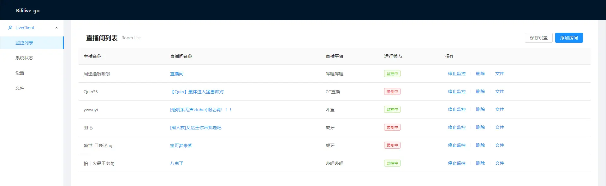

# Bililive-go
[](https://github.com/bililive-go/bililive-go/actions/workflows/tests.yaml)
[](https://goreportcard.com/report/github.com/bililive-go/bililive-go)
[](https://github.com/bililive-go/bililive-go/releases/latest)
[](https://hub.docker.com/r/chigusa/bililive-go/)
[](https://space.bilibili.com/18578203/)

Bililive-go是一个支持多种直播平台的直播录制工具   



## 支持网站

<table>
    <tr align="center">
        <th>站点</th>
        <th>url</th>
        <th>支持情况</th>
        <th>cookie</th>
    </tr>
    <tr align="center">
        <td>Acfun直播</td>
        <td>live.acfun.cn</td>
        <td>✅ 支持</td>
        <td></td>
    </tr>
    <tr align="center">
        <td>哔哩哔哩直播</td>
        <td>live.bilibili.com</td>
        <td>✅ 支持</td>
        <td>✅ 支持</td>
    </tr>
    <tr align="center">
        <td>战旗直播</td>
        <td>www.zhanqi.tv</td>
        <td>✅ 支持</td>
        <td></td>
    </tr>
    <tr align="center">
        <td>斗鱼直播</td>
        <td>www.douyu.com</td>
        <td>✅ 支持</td>
        <td></td>
    </tr>
    <tr align="center">
        <td>虎牙直播</td>
        <td>www.huya.com</td>
        <td>✅ 支持</td>
        <td></td>
    </tr>
    <tr align="center">
        <td>CC直播</td>
        <td>cc.163.com</td>
        <td>✅ 支持</td>
        <td></td>
    </tr>
    <tr align="center">
        <td>一直播</td>
        <td>www.yizhibo.com</td>
        <td>✅ 支持</td>
        <td></td>
    </tr>
    <tr align="center">
        <td>OPENREC</td>
        <td>www.openrec.tv</td>
        <td>✅ 支持</td>
        <td></td>
    </tr>
    <tr align="center">
        <td>企鹅电竞</td>
        <td>egame.qq.com</td>
        <td>✅ 支持</td>
        <td></td>
    </tr>
    <tr align="center">
        <td>浪live</td>
        <td>play.lang.live & www.lang.live</td>
        <td>✅ 支持</td>
        <td></td>
    </tr>
    <tr align="center">
        <td>花椒</td>
        <td>www.huajiao.com</td>
        <td>✅ 支持</td>
        <td></td>
    </tr>
    <tr align="center">
        <td>抖音直播</td>
        <td>live.douyin.com</td>
        <td>✅ 支持</td>
        <td>✅ 支持</td>
    </tr>
    <tr align="center">
        <td>猫耳</td>
        <td>fm.missevan.com</td>
        <td>✅ 支持</td>
        <td></td>
    </tr>
    <tr align="center">
        <td>克拉克拉</td>
        <td>www.hongdoufm.com</td>
        <td>✅ 支持</td>
        <td></td>
    </tr>
    <tr align="center">
        <td>YY直播</td>
        <td>www.yy.com</td>
        <td>✅ 支持</td>
        <td></td>
    </tr>
    <tr align="center">
        <td>微博直播</td>
        <td>weibo.com</td>
        <td>✅ 支持</td>
        <td></td>
    </tr>
    <tr align="center">
        <td>SOOP</td>
        <td>play.sooplive.co.kr</td>
        <td>✅ 支持（密码房除外）</td>
        <td>✅ 支持</td>
    </tr>
</table>

### cookie 在 config.yml 中的设置方法

cookie的设置以域名为单位。比如想在录制抖音直播时使用 cookie，那么 `config.yml` 中可以像下面这样写：
```
cookies:
  live.douyin.com: __ac_nonce=123456789012345678903;name=value
```
这里 name 和 value 只是随便举的例子，用来说明当添加超过一条 cookie 的键值对时应该用分号隔开。
至于具体应该添加哪些键，就需要用户针对不同网站自己获取了。

## 在网页中修改设置

点击网页左边的 `设置` 可以在线修改项目的配置文件，之后点击页面下面的 `保存设置` 按钮保存设置。
如果保存后窗口提醒设置保存成功，那就是配置文件已经被写入磁盘了。如果是保存失败，那可能是配置文件格式问题或者遇到程序 bug，总之磁盘上的配置文件没变。

在网页中即使保存配置成功也不一定表示相应的配置会立即生效。
有些配置需要停止监控后再重新开始监控才会生效，有些配置也许要重启程序才会生效。

## 网页播放器

点击对应直播间行右边的 `文件` 链接可以跳转到对应直播间的录播目录中。  
当然你点左边的 `文件` 一路找过去也行。

https://github.com/bililive-go/bililive-go/assets/2352900/6453900c-6321-417b-94f2-d65ec2ab3d7e

## 新增通知服务

新增了 Telegram、ntfy 通知服务，用户可以在 Telegram、ntfy 中收到直播开始、结束、异常等通知。

有关通知服务的更多信息，请参阅 [通知服务文档](docs/notify.md)。


## Grafana 面板

docker compose 用户可以取消项目根目录下 `docker-compose.yml` 文件中 prometheus 和 grafana 部分的注释以启用统计面板。  
这里是 [设置说明](docs/grafana.md)

非 docker compose 用户需要自行部署 prometheus 和 grafana。  
这里是 [一些建议](docs/grafana.md#%E6%89%8B%E5%8A%A8%E5%AE%89%E8%A3%85%E7%AC%94%E8%AE%B0)


## 依赖
* [ffmpeg](https://ffmpeg.org/)

## 安装和使用

### Windows
https://github.com/bililive-go/bililive-go/wiki/Install-Windows

### macOS
https://github.com/bililive-go/bililive-go/wiki/Install-macOS

### Linux
https://github.com/bililive-go/bililive-go/wiki/Install-Linux

### docker

使用 https://hub.docker.com/r/chigusa/bililive-go 镜像创建容器运行。

例如：
```
docker run --restart=always -v ~/config.yml:/etc/bililive-go/config.yml -v ~/Videos:/srv/bililive -p 8080:8080 -d chigusa/bililive-go
```

### docker compose

使用项目根目录下的 `docker-compose.yml` 配置文件启动 docker compose 运行。

例如：
```
docker compose up
```
此时默认使用 `config.docker.yml` 文件作为程序的配置文件，`Videos/` 目录作为录制视频的输出目录。

NAS 用户使用系统自带 GUI 创建 docker compose 的情况请参考群晖用 docker compose 安装 bgo 的 [图文说明](./docs/Synology-related.md#如何用-docker-compose-安装-bgo)

## 常见问题
[docs/FAQ.md](docs/FAQ.md)

## 开发环境搭建

支持 Windows、macOS、Linux 原生开发，无需 WSL。

### 前置要求

| 工具 | 版本要求 | 说明 |
|------|----------|------|
| [Go](https://golang.org/dl/) | 1.25+ | 后端开发语言 |
| [GNU Make](https://www.gnu.org/software/make/) | 4.0+ | 构建工具（见下方安装说明） |
| [Node.js](https://nodejs.org/) | 18+ | 前端构建 |
| [Git](https://git-scm.com/) | - | 版本控制 |
| [FFmpeg](https://ffmpeg.org/) | - | 可选，用于视频处理（程序会自动下载） |

### 安装 GNU Make

**Windows（推荐 Scoop）：**
```powershell
# 安装 Scoop（如果没有）
Set-ExecutionPolicy -ExecutionPolicy RemoteSigned -Scope CurrentUser
Invoke-RestMethod -Uri https://get.scoop.sh | Invoke-Expression

# 安装 Make
scoop install make
```

> ⚠️ Windows 上的 GnuWin32 Make（3.81）版本过旧，会导致编码问题。请使用 Scoop 或 Chocolatey 安装新版。

**macOS：** 系统自带 Make，或 `brew install make`

**Linux：** `sudo apt install make`（Debian/Ubuntu）

### 快速开始

```bash
# 1. 克隆代码
git clone https://github.com/bililive-go/bililive-go.git
cd bililive-go

# 2. 安装开发工具（delve 调试器、gopls 语言服务器等）
go generate ./tools/devtools.go

# 3. 安装前端依赖并构建
cd src/webapp && npm install && cd ../..
go run ./build.go build-web

# 4. 运行开发版本
go run ./build.go dev
```

### 使用 VSCode 开发

项目提供了预配置的 VSCode 调试模板。推荐的调试配置依赖任务配置，需要同时复制两个文件：

```bash
# 复制调试配置模板（两个文件都需要）
cp .vscode/launch.example.json .vscode/launch.json
cp .vscode/tasks.example.json .vscode/tasks.json
```

**文件依赖关系：**
- `launch.json` - 定义调试配置（如何启动程序、断点等）
- `tasks.json` - 定义构建任务（如增量编译）
- **🚀 Debug Main Program** 配置的 `preLaunchTask` 依赖 `tasks.json` 中的 `dev-incremental` 任务

然后：
1. 用 VSCode 打开项目
2. 按 `F5` 或打开 **Run and Debug** 面板
3. 选择 **🚀 Debug Main Program** 配置即可开始调试

**调试配置说明：**

| 配置 | 说明 |
|------|------|
| **🚀 Debug Main Program** | 推荐。使用增量编译，首次完整编译，后续只在源码变化时重新编译 |
| **Debug Main Program (Source)** | 直接从源码调试，每次都会编译（无需 tasks.json） |

> 💡 **提示**：增量编译会将二进制输出到 `bin/bililive-dev`（或 `bililive-dev.exe`），
> 这个文件名跨平台统一，便于调试配置复用。

> 💡 **提示**：`launch.json` 和 `tasks.json` 都已被 gitignore 忽略，你可以自由修改而不会影响仓库。
> 模板更新时，可对比 `.example.json` 的变更手动合并。

详细的调试配置说明见 [test/README.md](test/README.md)。

### 构建命令

项目支持两种构建方式：`go run ./build.go` 和 `make`。

| 功能 | go run 方式 | make 方式 |
|------|-------------|-----------|
| 查看帮助 | `go run ./build.go help` | `make help` |
| 开发构建 | `go run ./build.go dev` | `make dev` |
| 发布构建 | `go run ./build.go release` | `make build` |
| 构建前端 | `go run ./build.go build-web` | `make build-web` |
| 运行测试 | `go run ./build.go test` | `make test` |
| 代码生成 | `go run ./build.go generate` | `make generate` |
| 代码检查 | - | `make lint` |
| 清理产物 | - | `make clean` |
| E2E 测试 | - | `make test-e2e` |
| E2E 测试 (UI) | - | `make test-e2e-ui` |
| 查看测试报告 | - | `make show-report` |

```bash
# 示例：开发构建
go run ./build.go dev
# 或
make dev
```

### E2E 测试报告

运行 E2E 测试后，可以通过以下方式查看报告：

```bash
# 方式一：使用 Playwright 内置服务器（推荐，支持源码查看）
make show-report

# 方式二：启动在线报告服务器（适合团队分享，可从 GitHub 获取源码）
make serve-report COMMIT=0.8.0/dev
# 然后访问 http://localhost:9323
```

> 💡 **提示**: `serve-report` 会启动一个特殊的服务器，当本地源码不存在时，
> 会自动从 GitHub 获取对应 commit 的源码。这样可以在没有源码的机器上完整查看测试报告。

### 项目结构

```
bililive-go/
├── src/
│   ├── cmd/           # 主程序入口
│   │   ├── bililive/  # 主程序
│   │   └── launcher/  # 启动器（自动更新）
│   ├── configs/       # 配置管理
│   ├── live/          # 各平台直播解析
│   ├── pkg/           # 通用包
│   │   └── update/    # 自动更新模块
│   ├── recorders/     # 录制器实现
│   ├── servers/       # HTTP API
│   └── webapp/        # React 前端
├── test/              # 测试工具
├── tools/             # 开发工具依赖
├── config.yml         # 配置文件（用户创建）
└── build.go           # 构建脚本入口
```


## Wiki
[Wiki](https://github.com/bililive-go/bililive-go/wiki)

## API
[API doc](https://github.com/bililive-go/bililive-go/blob/master/docs/API.md)

## 参考
- [you-get](https://github.com/soimort/you-get)
- [ykdl](https://github.com/zhangn1985/ykdl)
- [youtube-dl](https://github.com/ytdl-org/youtube-dl)
