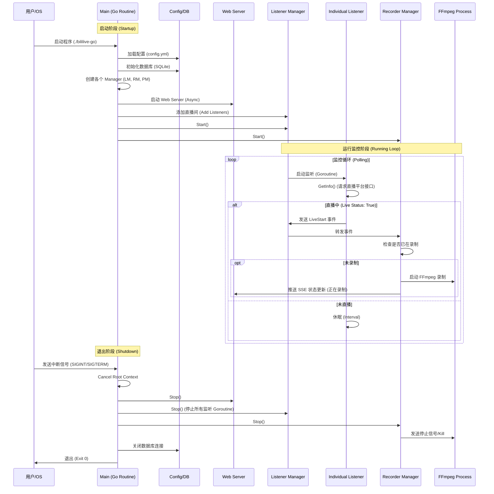

# Bililive-go 程序架构总结

## 1. 功能点简介 (Functional Points)

该程序是一个基于 Go 语言的直播录制工具，主要功能包括：

1.  **多平台直播监听 (Multi-platform Monitoring)**:
    *   支持 Bilibili、Douyin、Twitch 等多个主流直播平台的直播状态监控。
    *   通过轮询 API 或解析页面获取直播间状态。
2.  **自动录制 (Automatic Recording)**:
    *   当监控到直播开始时，自动启动录制进程（调用 ffmpeg）。
    *   支持自定义录制路径、文件名模板和格式。
3.  **Web 管理界面 (Web UI Management)**:
    *   提供基于 React 的 Web 前端，用于管理直播间列表、查看录制状态、配置系统参数。
    *   支持在线播放录制好的视频文件。
4.  **实时日志查看 (Real-time Logs)**:
    *   前端通过 SSE (Server-Sent Events) 实时接收并展示后端运行日志。
5.  **文件管理 (File Management)**:
    *   提供简单的文件管理功能，可对录制文件进行重命名、删除等操作。
6.  **配置热更新 (Configuration Hot-Reload)**:
    *   大部分配置修改后可即时生效或通过 API 触发重载。
7.  **流水线处理 (Pipeline Processing)**:
    *   支持录制完成后的后处理任务，如转码、上传等（通过 SQLite 队列管理）。
8.  **状态持久化 (State Persistence)**:
    *   使用 SQLite 数据库保存直播间配置、录制历史和元数据。

---

## 2. 程序架构图 (Architecture Diagram)

程序采用典型的前后端分离架构。后端负责核心逻辑、监控和录制，前端负责交互。

```mermaid
graph TB
    subgraph Frontend [前端 (React/Webapp)]
        UI[Web UI]
        APIClient[API Client]
        SSEClient[SSE Client]
    end

    subgraph Backend [后端 (Go)]
        Main[Main Entry]

        subgraph Core [核心模块]
            Config[配置模块 (Config)]
            DB[数据库 (SQLite)]
            LiveLib[直播源库 (src/live)]
        end

        subgraph Managers [管理模块]
            LM[Listener Manager (监听管理器)]
            RM[Recorder Manager (录制管理器)]
            PM[Pipeline Manager (流水线管理器)]
        end

        subgraph Server [网络服务]
            WebServer[HTTP Server (Gorilla Mux)]
            SSEHub[SSE Hub (实时推送)]
        end

        subgraph External [外部依赖]
            FFmpeg[FFmpeg 进程]
        end
    end

    UI --> APIClient
    UI --> SSEClient
    APIClient --> WebServer
    SSEClient --> SSEHub

    Main --> Config
    Main --> DB
    Main --> Managers
    Main --> WebServer

    WebServer --> LM
    WebServer --> RM
    WebServer --> Config
    WebServer -- Broadcast --> SSEHub

    LM -- Polls --> LiveLib
    LiveLib -- Request --> Internet((Internet))

    LM -- Event: LiveStart --> RM
    RM -- Spawns --> FFmpeg
    RM -- Status Update --> SSEHub

    RM -- Event: RecordFinish --> PM
    PM -- Task --> FFmpeg
```

**模块说明：**
*   **Main**: 程序入口，负责初始化各个组件。
*   **Config**: 处理 `config.yml` 的加载和存取。
*   **Managers**:
    *   `Listener Manager`: 管理所有直播间的监听任务（轮询）。
    *   `Recorder Manager`: 管理录制任务，负责启动和停止 FFmpeg。
    *   `Pipeline Manager`: 处理录制结束后的任务。
*   **Server**: 提供 RESTful API 供前端调用，以及 SSE 接口推送实时消息。
*   **LiveLib**: 封装了各个直播平台的具体解析逻辑（如 Bilibili, Douyin）。

---

## 3. 生命周期调用流程图 (Lifecycle Diagram)

以下是程序从启动、运行监控循环、触发录制到最终退出的典型生命周期。


