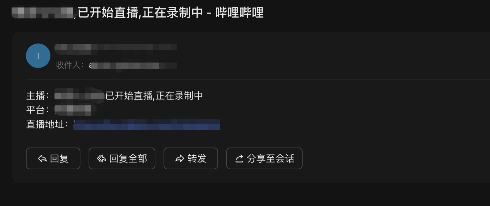

# Notify 通知模块

## 功能说明

该模块提供统一的通知发送功能，支持以下通知方式：
- Telegram 消息通知
- Email 邮件通知
- Bark iOS 推送通知

## 使用方法

### 发送telegram通知

https://core.telegram.org/bots#6-botfather

#### 示例展示


### 发送email测试通知(QQ邮箱示例)

https://wx.mail.qq.com/list/readtemplate?name=app_intro.html#/agreement/authorizationCode


#### 示例展示



### 发送Bark通知

Bark 是一个简单的 iOS 推送通知应用。

1. 在 iOS 设备上安装 Bark 应用
2. 打开应用获取你的设备密钥（Device Key）
3. 服务器地址通常为：`https://api.day.app/你的设备密钥`

#### 配置示例

```yaml
notify:
  bark:
    enable: true
    serverURL: "https://api.day.app/your_device_key"
```

## 配置说明

在配置文件中启用相应的通知服务：

```yaml
# 通知服务配置
notify:
  telegram:
    enable: true                # 是否启用Telegram通知
    withNotification: true      # 是否在Telegram通知中包含通知内容（是否有声音通知）
    botToken: "YOUR_BOT_TOKEN"  # Telegram机器人的Token
    chatID: "YOUR_CHAT_ID"      # 接收通知的Chat ID
  
  email:
    enable: true                # 是否启用邮件通知
    smtpHost: "smtp.example.com" # SMTP服务器地址
    smtpPort: 465               # SMTP服务器端口
    senderEmail: "sender@example.com"    # 发送者邮箱
    senderPassword: "password"  # 发送者邮箱密码或授权码
    recipientEmail: "recipient@example.com"  # 接收者邮箱
  
  bark:
    enable: true                # 是否启用Bark通知
    serverURL: "https://api.day.app/your_device_key"  # Bark服务器地址
```

## 注意事项

1. 请确保在使用通知功能前已正确配置相关参数
2. 函数会自动检测启用的通知方式并发送，如果某种通知方式发送失败，不会影响其他通知方式的发送
3. 邮件通知使用SMTP协议发送，请确保SMTP服务器配置正确
